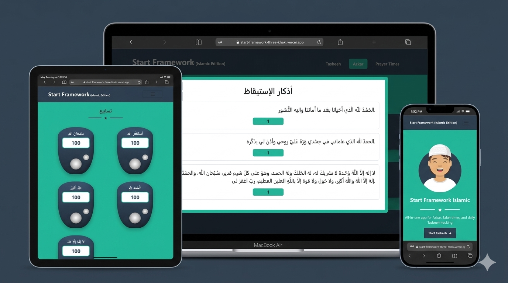

# 🕌 Start Framework Islamic

An Islamic website for daily Azkar, prayer times, Tasbeeh, and spiritual reminders to help Muslims stay connected with their faith every day. 

---

## 💡 Key Features:

🟢 Built a seamless SPA experience using createBrowserRouter for smooth client-side navigation 𝘄𝗶𝘁𝗵𝗼𝘂𝘁 𝗽𝗮𝗴𝗲 𝗿𝗲𝗹𝗼𝗮𝗱𝘀.  
🟢 Implemented a 𝘀𝗵𝗮𝗿𝗲𝗱 𝗟𝗮𝘆𝗼𝘂𝘁 component using <Outlet /> to render dynamic pages with a consistent Navbar and Footer structure.  
🟢 Added a 𝗡𝗼𝘁𝗙𝗼𝘂𝗻𝗱 page for invalid routes and built a 𝗿𝗲𝘂𝘀𝗮𝗯𝗹𝗲 SharedStar component for consistent UI across pages.  
🟢 Used 𝘂𝘀𝗲𝗦𝘁𝗮𝘁𝗲 for Tasbeeh/Azkar counters and modal states, and 𝘂𝘀𝗲𝗘𝗳𝗳𝗲𝗰𝘁 to fetch local JSON data and simulate API behavior with reactive UI updates.  
🟢 Implemented 𝘀𝗰𝗿𝗼𝗹𝗹-𝗯𝗮𝘀𝗲𝗱 𝗨𝗜 changes using window.scrollY and 𝗮𝗰𝘁𝗶𝘃𝗲 𝗿𝗼𝘂𝘁𝗲 highlighting with NavLink from React Router.  
🟢 Integrated the 𝗔𝗹𝗮𝗱𝗵𝗮𝗻 𝗣𝗿𝗮𝘆𝗲𝗿 𝗧𝗶𝗺𝗲𝘀 𝗔𝗣𝗜 using async fetch to dynamically display daily prayer times 𝗯𝘆 𝗰𝗶𝘁𝘆, 𝗰𝗼𝘂𝗻𝘁𝗿𝘆, 𝗮𝗻𝗱 𝗱𝗮𝘁𝗲.  
🟢 Built a 𝗳𝘂𝗹𝗹𝘆 𝗿𝗲𝘀𝗽𝗼𝗻𝘀𝗶𝘃𝗲 𝗹𝗮𝘆𝗼𝘂𝘁 for mobile, tablet, and desktop devices.  

---

## 🛠️ Tech Stack

- **React.js** 
- **Vite**
- **CSS Modules**  
- **Bootstrap 5**  
- **React Router DOM**  
- **React Icons**

---

## 🔑 Key Concepts

- **Routing (SPA with createBrowserRouter)** 
- **State Management (useState)**
- **React Hooks (useEffect)**  
- **API Integration (async/await)**  
- **Responsive Design**
- **Reusable Components**  
- **Dynamic UI Behavior**

---

## 💻 GitHub Repo & Live Demo

🔗 **GitHub Repo:** [Start Framework Islamic](https://github.com/Doaa182/Start-Framework)  
🌐 **Live Demo:** [View on GitHub Pages](https://start-framework-three-khaki.vercel.app/)

---

## 👩‍💻 Author

**Doaa Diaa El Din**  
🔗 [GitHub Profile](https://github.com/Doaa182)

---
## 📸 Screenshot
 

